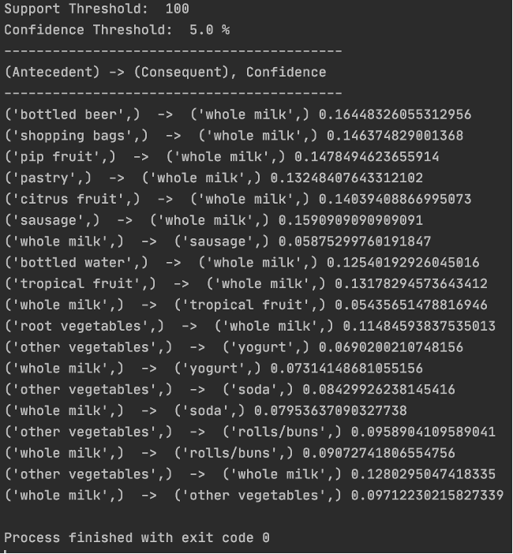

# fp-growth
Python implementation of the fp-growth algorithm for discovering frequent itemsets within a grocery store transaction database.

## Table of Contents
* [General info](#general-info)
* [Technologies](#technologies)
* [Setup](#setup)
* [Author](#author)

## General Info
The motivation behind this project, and code explanation, can be found [here](https://www-users.cs.umn.edu/~kumar001/dmbook/ch5_association_analysis.pdf). This project uses a [CSV file](https://raw.githubusercontent.com/robertnetti/fp-growth/main/fpGrowth/transactions.csv) containing market basket transactions to find frequent itemsets.<br /><br />



## Technologies
Project is created with:
* Python version: 3.9.5
* Pandas library version: 1.2.4
* Itertools module

## Setup
To run this project, make sure git is installed, move to your desired directory, and run the following commands.

```
$ git clone https://github.com/robertnetti/fp-growth.git
$ cd fp-growth
$ cd fpGrowth
$ python3 fp-growth.py
```

## Author
* Robert Netti
* Linkedin: [https://www.linkedin.com/in/robert-netti/](https://www.linkedin.com/in/robert-netti/)

